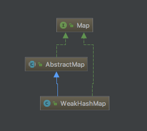
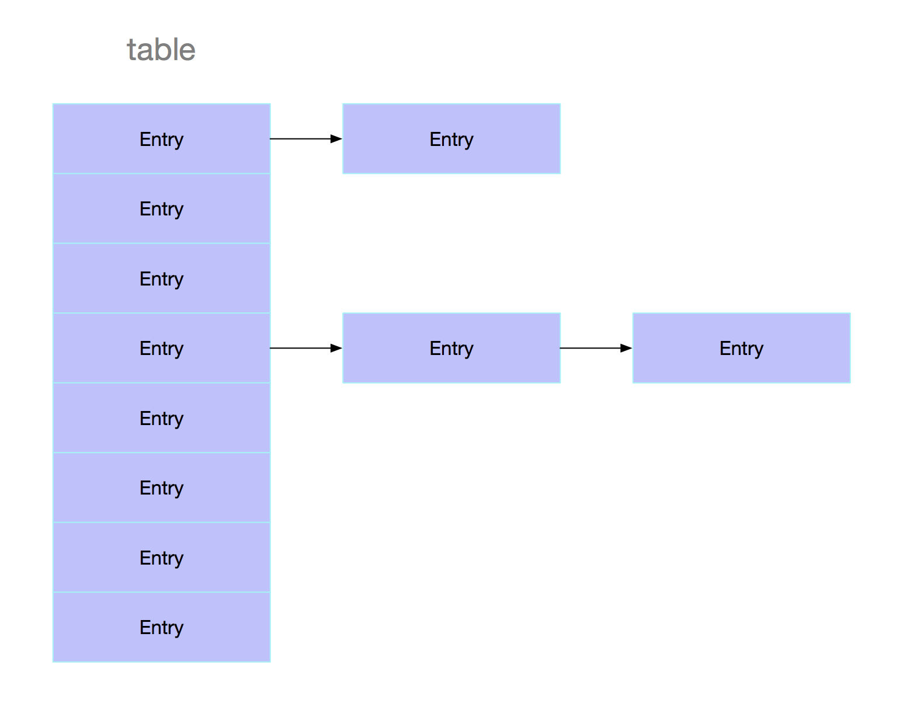
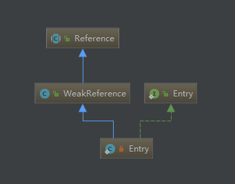

> 源码详解系列均基于`JDK8`进行解析

## 说明

在Java容器详解系列文章的最后，介绍一个相对特殊的成员：*WeakHashMap*，从名字可以看出它是一个 *Map*。它的使用上跟HashMap并没有什么区别，所以很多地方这里就不做过多介绍了，可以翻看一下前面HashMap中的内容。本篇主要介绍它与HashMap的不同之处。

*WeakHashMap* 特殊之处在于 *WeakHashMap* 里的`entry`可能会被垃圾回收器自动删除，也就是说即使你没有调用`remove()`或者`clear()`方法，它的entry也可能会慢慢变少。所以多次调用比如isEmpty，containsKey，size等方法时可能会返回不同的结果。

接下来希望能带着这么几个问题来进行阅读：

1、WeakHashMap中的Entry为什么会自动被回收。

2、WeakHashMap与HashMap的区别是什么。

3、WeakHashMap的引用场景有哪些。

## WeakHashMap探秘

从说明可以看出，WeakHashMap的特殊之处便在于它的Entry与众不同，里面的Entry会被垃圾回收器自动回收，那么问题来了，为什么会被自动回收呢？HashMap里的Entry并不会被自动回收，除非把它从Map中移除掉。

其实这个秘密就在于[弱引用](../reference/weak-reference.md)，WeakHashMap中的key是间接保存在弱引用中的，所以当key没有被继续使用时，就可能会在GC的时候被回收掉。

只有key对象是使用弱引用保存的，value对象实际上仍旧是通过普通的强引用来保持的，所以应该确保value不会直接或者间接的保持其对应key的强引用，因为这样会阻止key被回收。

如果对于引用类型不熟悉的话，可以先阅读[这篇文章](../reference/four-kinds-of-reference.md)。

下面来从源码角度看看具体是如何实现这个特性的。

## 继承结构



WeakHashMap并不是继承自HashMap，而是继承自AbstractMap，跟HashMap的继承结构差不多。

## 存储结构

WeakHashMap中的数据结构是数组+链表的形式，这一点跟HashMap也是一致的，但不同的是，在JDK8中，当发生较多key冲突的时候，HashMap中会由链表转为红黑树，而WeakHashMap则一直使用链表进行存储。



## 成员变量

```java
// 默认初始容量，必须是2的幂
private static final int DEFAULT_INITIAL_CAPACITY = 16;

// 最大容量
private static final int MAXIMUM_CAPACITY = 1 << 30;

// 默认装载因子
private static final float DEFAULT_LOAD_FACTOR = 0.75f;

// Entry数组，长度必须为2的幂
Entry<K,V>[] table;

// 元素个数
private int size;

// 阈值 
private int threshold;

// 装载因子
private final float loadFactor;

// 引用队列
private final ReferenceQueue<Object> queue = new ReferenceQueue<>();

// 修改次数
int modCount;
```

跟HashMap的成员变量几乎一致，这里多了一个ReferenceQueue，用来存放那些已经被回收了的弱引用对象。如果想知道ReferenceQueue是如何工作的，可以参考[这篇文章](../reference/reference-queue-code-detail.md)。

## 构造函数

WeakHashMap中也有四个构造函数：

```java
public WeakHashMap(int initialCapacity, float loadFactor) {
	...
}

public WeakHashMap(int initialCapacity) {
    this(initialCapacity, DEFAULT_LOAD_FACTOR);
}

public WeakHashMap() {
    this(DEFAULT_INITIAL_CAPACITY, DEFAULT_LOAD_FACTOR);
}

public WeakHashMap(Map<? extends K, ? extends V> m) {
    this(Math.max((int) (m.size() / DEFAULT_LOAD_FACTOR) + 1,
                  DEFAULT_INITIAL_CAPACITY),
         DEFAULT_LOAD_FACTOR);
    putAll(m);
}
```

可以看到后三个，都是调用的第一个构造函数，下面再来看一下第一个构造函数的内容：

```java
// 校验initialCapacity
if (initialCapacity < 0)
    throw new IllegalArgumentException("Illegal Initial Capacity: "+
                                       initialCapacity);
if (initialCapacity > MAXIMUM_CAPACITY)
    initialCapacity = MAXIMUM_CAPACITY;

// 校验loadFactor
if (loadFactor <= 0 || Float.isNaN(loadFactor))
    throw new IllegalArgumentException("Illegal Load factor: "+
                                       loadFactor);
int capacity = 1;
// 将容量设置为大于initialCapacity的最小2的幂
while (capacity < initialCapacity)
    capacity <<= 1;
table = newTable(capacity);
this.loadFactor = loadFactor;
threshold = (int)(capacity * loadFactor);
```

再看看newTable函数。

```java
private Entry<K,V>[] newTable(int n) {
    return (Entry<K,V>[]) new Entry<?,?>[n];
}
```

这里其实只是简单的创建一个Entry数组。

## Entry剖析

接下来看看WeakHashMap中的核心角色——Entry。上面已经看到了，WeakHashMap中的table是一个Entry数组：

```java
Entry<K,V>[] table;
```

来看看Entry长什么样：

```java
private static class Entry<K,V> extends WeakReference<Object> implements Map.Entry<K,V> {
	...   
}
```

Entry继承自WeakReference，继承关系图如下：



再来看看Entry中的内容：

```java
// 成员变量
V value;
final int hash;
Entry<K,V> next;

// 构造函数
Entry(Object key, V value,
      ReferenceQueue<Object> queue,
      int hash, Entry<K,V> next) {
    super(key, queue);
    this.value = value;
    this.hash  = hash;
    this.next  = next;
}
```

细心的你可能会发现，哎？key哪里去了，成员变量里没有key。别着急，看看构造函数就可以发现，它调用了父类的构造函数。

```java
super(key, queue);
```

这里调用的WeakReference的构造函数，将key传入Reference中，保存在referent成员变量中。对Reference和WeakReference不熟悉的话可以参考[这篇文章](../reference/reference-code-detail.md)和[这篇文章](../reference/weak-reference-code-detail.md)。

再看看其它几个方法：

```java
@SuppressWarnings("unchecked")
public K getKey() {
    // 这里调用了Reference的get方法，从中取出referent对象
    // WeakHashMap中，key如果为null会使用NULL_KEY来替代
    return (K) WeakHashMap.unmaskNull(get());
}

public V getValue() {
    return value;
}

public V setValue(V newValue) {
    V oldValue = value;
    value = newValue;
    return oldValue;
}

public boolean equals(Object o) {
    if (!(o instanceof Map.Entry))
        return false;
    Map.Entry<?,?> e = (Map.Entry<?,?>)o;
    K k1 = getKey();
    Object k2 = e.getKey();
    if (k1 == k2 || (k1 != null && k1.equals(k2))) {
        V v1 = getValue();
        Object v2 = e.getValue();
        if (v1 == v2 || (v1 != null && v1.equals(v2)))
            return true;
    }
    return false;
}

public int hashCode() {
    K k = getKey();
    V v = getValue();
    // 这里只是简单的把key和value的hashcode做一个异或处理
    return Objects.hashCode(k) ^ Objects.hashCode(v);
}

public String toString() {
    return getKey() + "=" + getValue();
}
```

这里稍微说一下getKey方法，调用了WeakHashMap.unmaskNull，之所以要调用这个方法，其实是因为WeakHashMap中对key为null时的特殊处理，会将其指向一个特殊的内部变量：

```java
private static final Object NULL_KEY = new Object();
```

与其对应的两个方法便是：

```java
private static Object maskNull(Object key) {
    return (key == null) ? NULL_KEY : key;
}

static Object unmaskNull(Object key) {
    return (key == NULL_KEY) ? null : key;
}
```

所以，其他WeakHashMap中的Entry最大的不同就是继承自WeakReference，并把key保存在了WeakReference中。可以说WeakHashMap的特性绝大部分都是WeakReference的功劳。

## 常用方法

主要的方法有这些：

```java
void                   clear()
Object                 clone()
boolean                containsKey(Object key)
boolean                containsValue(Object value)
Set<Entry<K, V>>       entrySet()
V                      get(Object key)
boolean                isEmpty()
Set<K>                 keySet()
V                      put(K key, V value)
void                   putAll(Map<? extends K, ? extends V> map)
V                      remove(Object key)
int                    size()
Collection<V>          values()
```

这里选其中的三个最常用的方法进行解析：

### put方法

```java
public V put(K key, V value) {
    // 处理null值
    Object k = maskNull(key);
    // 计算hash
    int h = hash(k);
    // 获取table
    Entry<K,V>[] tab = getTable();
    // 计算下标
    int i = indexFor(h, tab.length);

    // 查找Entry
    for (Entry<K,V> e = tab[i]; e != null; e = e.next) {
        if (h == e.hash && eq(k, e.get())) {
            V oldValue = e.value;
            if (value != oldValue)
                e.value = value;
            return oldValue;
        }
    }
	
    modCount++;
    Entry<K,V> e = tab[i];
    tab[i] = new Entry<>(k, value, queue, h, e);
    // 如果元素个数超过阈值，则进行扩容
    if (++size >= threshold)
        resize(tab.length * 2);
    return null;
}
```

这里涉及到的方法比较多，不慌不慌，一个一个来。

先来看看hash方法：

```java
final int hash(Object k) {
    int h = k.hashCode();
    // 这里做了二次散列，来扩大低位的影响
    h ^= (h >>> 20) ^ (h >>> 12);
    return h ^ (h >>> 7) ^ (h >>> 4);
}
```

hash方法对key的hashcode进行了二次散列，主要是为了扩大低位的影响。因为Entry数组的大小是2的幂，在进行查找的时候，进行掩码处理，如果不进行二次散列，那么低位对index就完全没有影响了，如果不清楚也没有关系，之后在get方法里会有说明。

至于为什么要选20,12,7,4。emmm，大概是效果奇佳吧（一本正经的胡说八道，有兴趣的话可以自行研究）。

再看看indexFor函数，这里就是将数组长度减1后与hashcode做一个位与操作，因为length必定是2的幂，所以减1后就变成了掩码，再进行与操作就能直接得到hashcode mod length的结果了，但是这样操作效率会更高。

```java
private static int indexFor(int h, int length) {
    return h & (length-1);
}
```

再来看看getTable方法：

```java
private Entry<K,V>[] getTable() {
    // 清除被回收的Entry对象
    expungeStaleEntries();
    return table;
}

private void expungeStaleEntries() {
    for (Object x; (x = queue.poll()) != null; ) {
        // 循环获取引用队列中的对象
        synchronized (queue) {
            @SuppressWarnings("unchecked")
            Entry<K,V> e = (Entry<K,V>) x;
            // 查找对应的位置
            int i = indexFor(e.hash, table.length);

            // 找到之前的Entry
            Entry<K,V> prev = table[i];
            Entry<K,V> p = prev;
            // 在链表中寻找
            while (p != null) {
                Entry<K,V> next = p.next;
                if (p == e) {
                    if (prev == e)
                        table[i] = next;
                    else
                        prev.next = next;
                    // 将对应的value置为null，帮助GC回收
                    e.value = null;
                    size--;
                    break;
                }
                prev = p;
                p = next;
            }
        }
    }
}
```

所以每次调用getTable的时候，都会将table中key已经被回收掉的Entry移除掉。

resize方法：

```java
void resize(int newCapacity) {
    // 获取当前table
    Entry<K,V>[] oldTable = getTable();
    int oldCapacity = oldTable.length;
    if (oldCapacity == MAXIMUM_CAPACITY) {
        threshold = Integer.MAX_VALUE;
        return;
    }

    // 新建一个table
    Entry<K,V>[] newTable = newTable(newCapacity);
    // 将旧table中的内容复制到新table中
    transfer(oldTable, newTable);
    table = newTable;

    if (size >= threshold / 2) {
        threshold = (int)(newCapacity * loadFactor);
    } else {
        expungeStaleEntries();
        transfer(newTable, oldTable);
        table = oldTable;
    }
}
// 新建Entry数组
private Entry<K,V>[] newTable(int n) {
    return (Entry<K,V>[]) new Entry<?,?>[n];
}

private void transfer(Entry<K,V>[] src, Entry<K,V>[] dest) {
    for (int j = 0; j < src.length; ++j) {
        Entry<K,V> e = src[j];
        src[j] = null;
        while (e != null) {
            Entry<K,V> next = e.next;
            Object key = e.get();
            if (key == null) {
                e.next = null; 
                e.value = null; 
                size--;
            } else {
                int i = indexFor(e.hash, dest.length);
                e.next = dest[i];
                dest[i] = e;
            }
            e = next;
        }
    }
}
```

### get方法

```java
public V get(Object key) {
    // 对null值特殊处理
    Object k = maskNull(key);
    // 取key的hash值
    int h = hash(k);
    // 取当前table
    Entry<K,V>[] tab = getTable();
    // 获取下标
    int index = indexFor(h, tab.length);
    Entry<K,V> e = tab[index];
    // 链表中查找元素
    while (e != null) {
        if (e.hash == h && eq(k, e.get()))
            return e.value;
        e = e.next;
    }
    return null;
}
```

在查找元素的时候调用了一个eq方法：

```java
private static boolean eq(Object x, Object y) {
    return x == y || x.equals(y);
}
```

### remove方法

```java
public V remove(Object key) {
    // 对null值特殊处理
    Object k = maskNull(key);
    // 取key的hash
    int h = hash(k);
    // 取当前table
    Entry<K,V>[] tab = getTable();
    // 计算下标
    int i = indexFor(h, tab.length);
    Entry<K,V> prev = tab[i];
    Entry<K,V> e = prev;

    while (e != null) {
        Entry<K,V> next = e.next;
        // 查找对应Entry
        if (h == e.hash && eq(k, e.get())) {
            modCount++;
            size--;
            if (prev == e)
                tab[i] = next;
            else
                prev.next = next;
            // 如果找到，返回对应Entry的value
            return e.value;
        }
        prev = e;
        e = next;
    }

    return null;
}
```

## 使用栗子

```java
public class WeakHashMapTest {
    public static void main(String[] args){
        testWeakHashMap();
    }

    private static void testWeakHashMap() {
        // 创建3个String对象用来做key
        String w1 = new String("key1");
        String w2 = new String("key2");
        String w3 = new String("key3");

        // 新建WeakHashMap
        Map weakHashMap = new WeakHashMap();

        // 添加键值对
        weakHashMap.put(w1, "v1");
        weakHashMap.put(w2, "v2");
        weakHashMap.put(w3, "v3");

        // 打印出weakHashMap
        System.out.printf("weakHashMap:%s\n", weakHashMap);

        // containsKey(Object key) :是否包含键key
        System.out.printf("contains key key1 : %s\n",weakHashMap.containsKey("key1"));
        System.out.printf("contains key key4 : %s\n",weakHashMap.containsKey("key4"));

        // containsValue(Object value) :是否包含值value
        System.out.printf("contains value v1 : %s\n",weakHashMap.containsValue("v1"));
        System.out.printf("contains value 0 : %s\n",weakHashMap.containsValue(0));

        // remove(Object key) ： 删除键key对应的键值对
        weakHashMap.remove("three");

        System.out.printf("weakHashMap: %s\n", weakHashMap);


        // ---- 测试 WeakHashMap 的自动回收特性 ----

        // 将w1设置null。
        // 这意味着“弱键”w1再没有被其它对象引用，调用gc时会回收WeakHashMap中与“w1”对应的键值对
        w1 = null;

        // 内存回收。这里，会回收WeakHashMap中与“w1”对应的键值对
        System.gc();

        // 遍历WeakHashMap
        Iterator iter = weakHashMap.entrySet().iterator();
        while (iter.hasNext()) {
            Map.Entry en = (Map.Entry)iter.next();
            System.out.printf("next : %s - %s\n",en.getKey(),en.getValue());
        }
        // 打印WeakHashMap的实际大小
        System.out.printf("after gc WeakHashMap size:%s\n", weakHashMap.size());
    }
}
```

输出如下：

```java
weakHashMap:{key1=w1, key2=w2, key3=w3}
contains key key1 : true
contains key key4 : false
contains value w1 : true
contains value 0 : false
weakHashMap: {key1=w1, key2=w2, key3=w3}
next : key2 - w2
next : key3 - w3
after gc WeakHashMap size:2
```

可以看到，w1对应的Entry被回收掉了，这就是WeakHashMap的最重要特性，当然，实际使用的时候一般不会这样使用，

## 应用场景

由于WeakHashMap可以自动清除Entry，所以比较适合用于存储非必需对象，用作缓存非常合适。

```java
public final class ConcurrentCache<K,V> {

    private final int size;

    private final Map<K,V> eden;

    private final Map<K,V> longterm;

    public ConcurrentCache(int size) {
        this.size = size;
        this.eden = new ConcurrentHashMap<>(size);
        this.longterm = new WeakHashMap<>(size);
    }

    public V get(K k) {
        V v = this.eden.get(k);
        if (v == null) {
            synchronized (longterm) {
                v = this.longterm.get(k);
            }
            if (v != null) {
                this.eden.put(k, v);
            }
        }
        return v;
    }

    public void put(K k, V v) {
        if (this.eden.size() >= size) {
            synchronized (longterm) {
                this.longterm.putAll(this.eden);
            }
            this.eden.clear();
        }
        this.eden.put(k, v);
    }
}
```

在put方法里，在插入一个键值对时，先检查eden缓存的容量是不是超过了阈值，如果没有超就直接放入eden缓存，如果超了就将eden中所有的键值对都放入longterm（这里longterm类似于老年代，eden类似于年轻代），再将eden清空并插入相应键值对。

在get方法中，也是优先从eden中找对应的value，如果没有则进入longterm缓存中查找，找到后就加入eden缓存并返回。

这样设计的好处是，能将相对常用的对象都能在eden缓存中找到，不常用的则存入longterm缓存，并且由于WeakHashMap能自动清除Entry，所以不用担心longterm中键值对过多而导致OOM。

WeakHashMap还有这样一个不错的应用场景，配合事务进行使用，存储事务过程中的各类信息。可以使用如下结构：

```java
WeakHashMap<String,Map<K,V>> transactionCache;
```

这里key为String类型，可以用来标志区分不同的事务，起到一个事务id的作用。value是一个map，可以是一个简单的HashMap或者LinkedHashMap，用来存放在事务中需要使用到的信息。

在事务开始时创建一个事务id，并用它来作为key，事务结束后，将这个强引用消除掉，这样既能保证在事务中可以获取到所需要的信息，又能自动释放掉map中的所有信息。

## 小结

- WeakHashMap是一个会自动清除Entry的Map
- WeakHashMap的操作与HashMap完全一致
- WeakHashMap内部数据结构是数组+链表
- WeakHashMap常被用作缓存