# Java开发环境搭建——Mac篇

主要分为以下几个步骤：

1.到Oracle官网下载JDK1.8安装包。

2.打开获取到的安装包按步骤安装到系统上。

3.配置系统的环境变量。

4.验证JDK1.8是否安装成功。

【由于电脑上已经安装过了jdk8，所以偷懒把别人的文章搬过来了，[原文链接](https://blog.csdn.net/deliciousion/article/details/78046007)】

## 一、下载JDK8

通过下面Oracle官网找到对应的JDK1.8安装包

https://www.oracle.com/index.html

打开后如下所示，Oracle主页内容经常变动，读者打开后很有可能不一样。

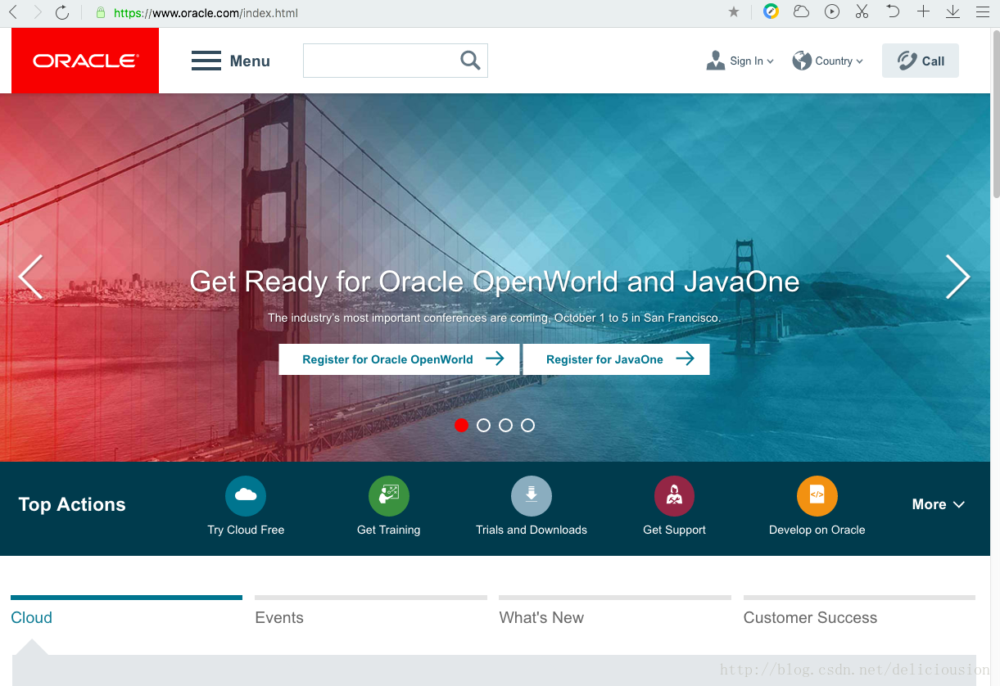


拉到页面底部，找到“Download Java for Developers”，如下红框所示。

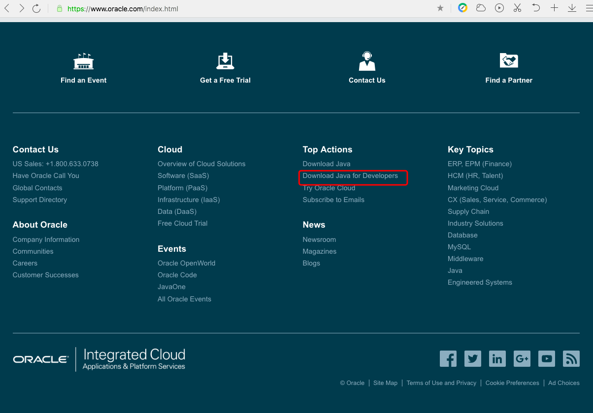

点开链接后，如下图所示，再点击红框位置，只下载JDK1.8，红框右边的链接是JDK1.8加上NetBeans，一个挺好用的JAVA IDE（集成化开发环境），有需要的可以下载。

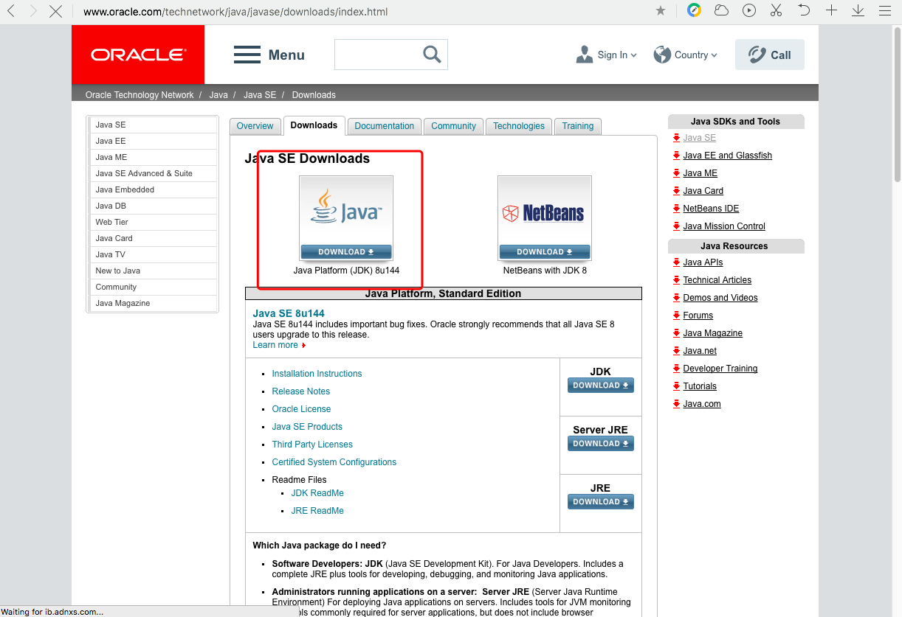


进入页面后第一步，点击“Accept License Agreement”同意许可证协议。第二步选择JDK对应的操作系统。本次选择“MAC OS X”，最后把相应的安装包下载到本地。

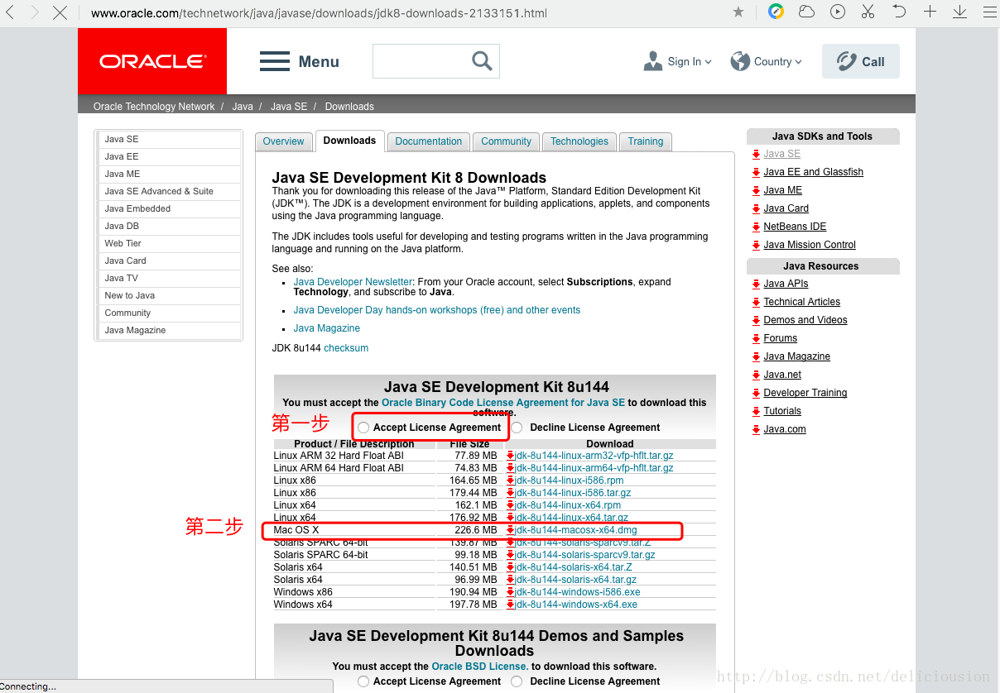

## 二、安装JDK
下载完成后，我们得到一个dmg的安装包，如下图所示，名称为 jdk-8u144-macosx-x64.dmg ，表示这是Java 8版本号为144的JDK安装包。

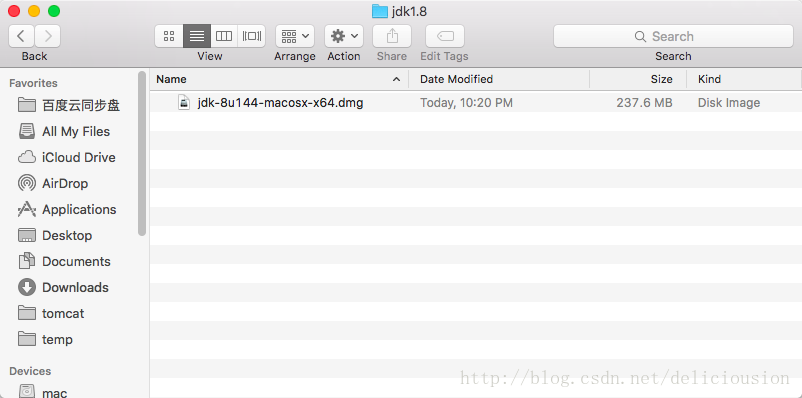

双击dmg安装包，打开如下图所示窗口。按照红框的提示，便可轻松完成安装。

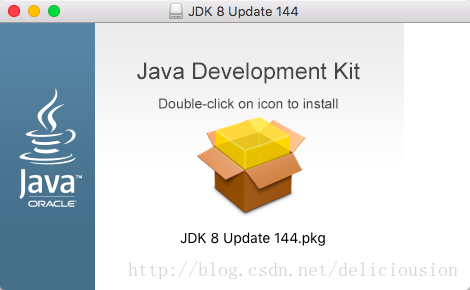


再双击中间的pkg文件，开始安装，如下图所示。

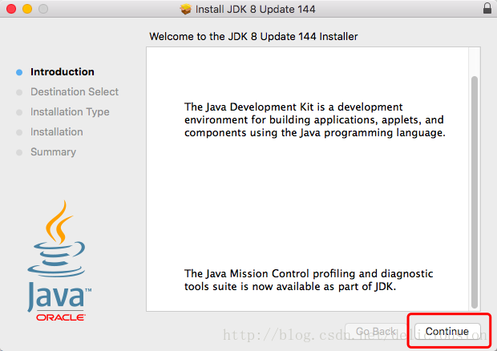

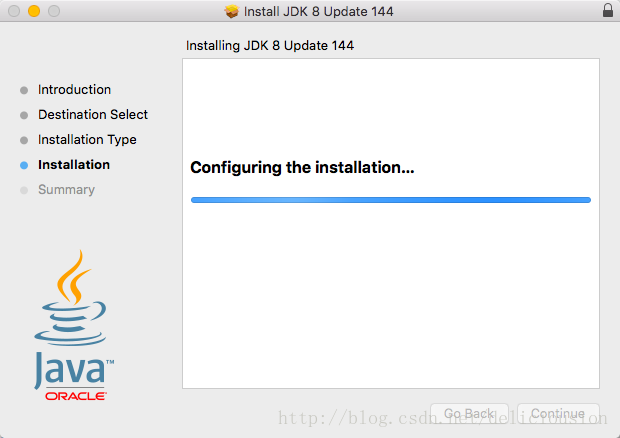

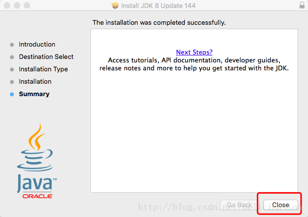

## 三、配置系统的环境变量

上一步骤，实标上，我们只是把JDK1.8的文件复制到操作系统上。但是我们如果要在terminal终端上使JAVA命令，还有让其实应用知道JDK1.8环境的存在，那我们还需要配置系统的环境变量。

首先我们得知道JDK目录安装在哪里，按照下面的路径我们可以找到JDK的主目录，如下图所示。这里有两个目录是因为本机较早前安装过早期版本的JDK1.8。

/Library/Java/JavaVirtualMachines

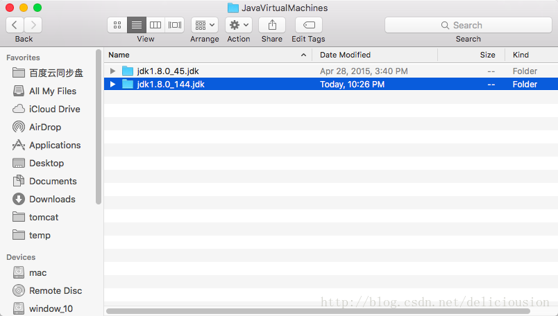


由于MAC文件系统结构，与WINDOWS有所不一样，所以jdk的真实主目录如下

/Library/Java/JavaVirtualMachines/jdk1.8.0_144.jdk/Contents/Home

打开terminal终端，默认打开在自身home家目录下，也可通过cd命令直接跳到家目录。

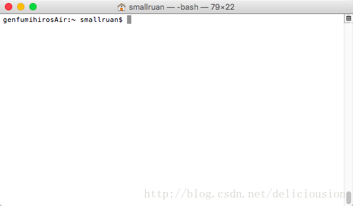

通过 vim .bash_profile 命令打开启动文件，修改内容

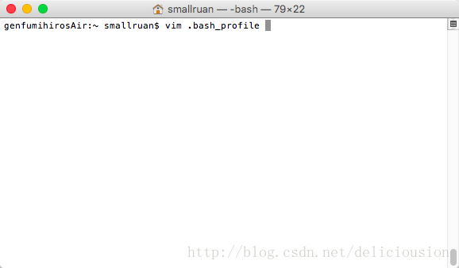

进入vim，按I进入编辑状态。添加如下内容，如下图所示。再按ESC，输入“:wq”保存退出。配置系统环境变量结束。

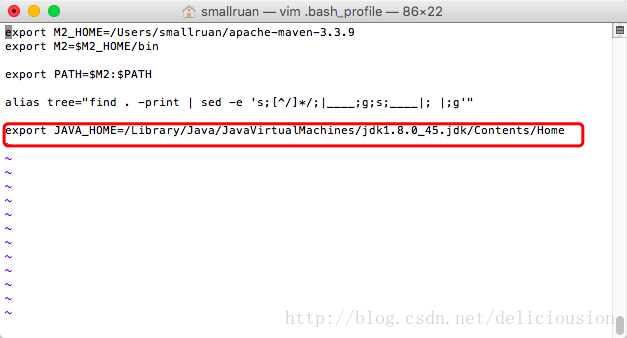

添加如下内容：

```bash
export JAVA_HOME=/Library/Java/JavaVirtualMachines/jdk1.8.0_45.jdk/Contents/Home
```

注意将jdk1.8.0_45这里改为你下载的JDK版本，不清楚的话，到/Library/Java/JavaVirtualMachines/这个目录下找找。

## 四、验证JDK1.8是否安装成功。

在终端输入java,有如下画面，证明配置成功

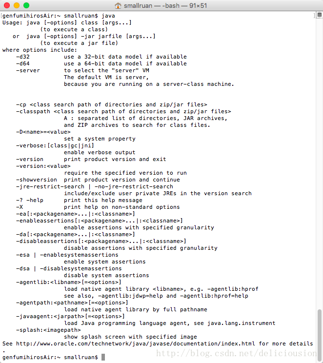

或输入java -version，有如下版本信息。

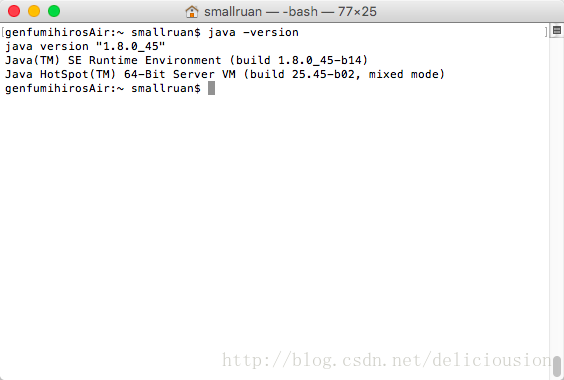

至此，整个安装JDK1.8过程结束
