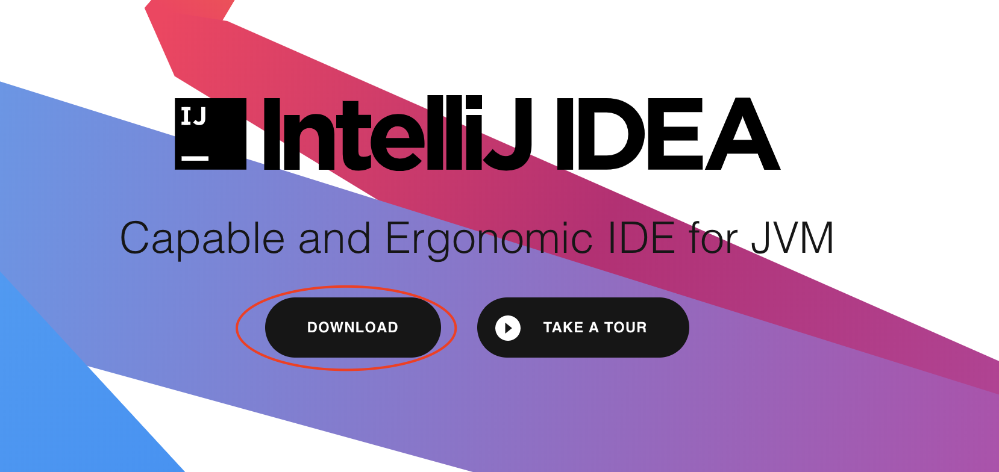
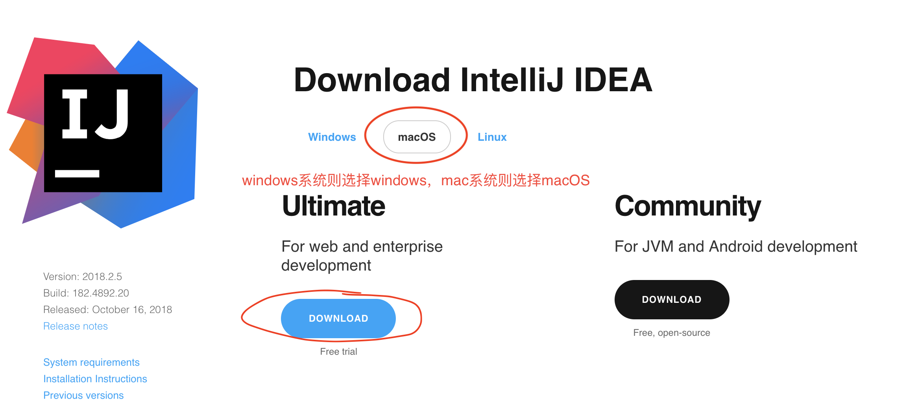
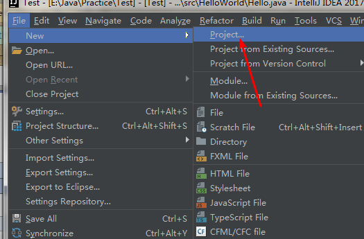
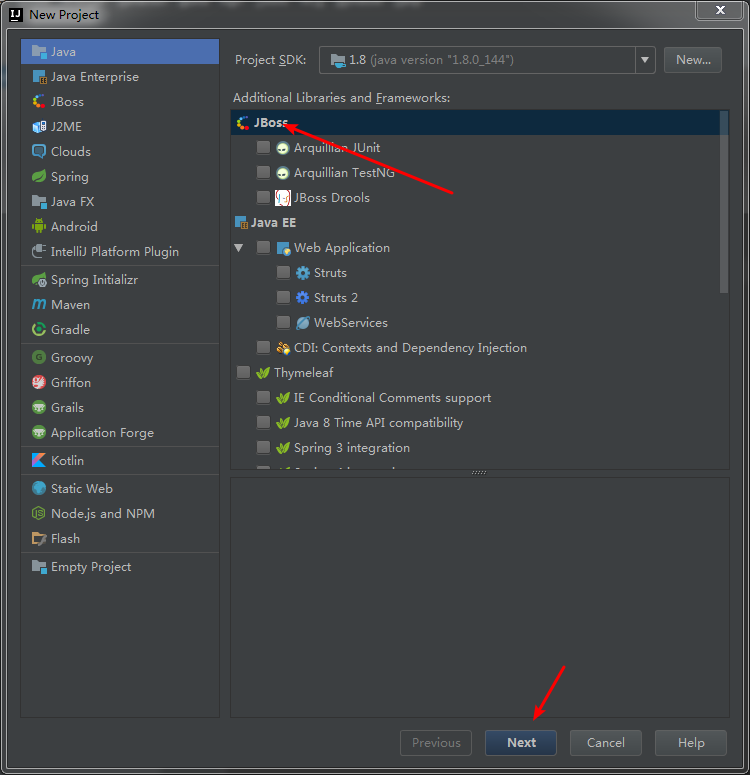
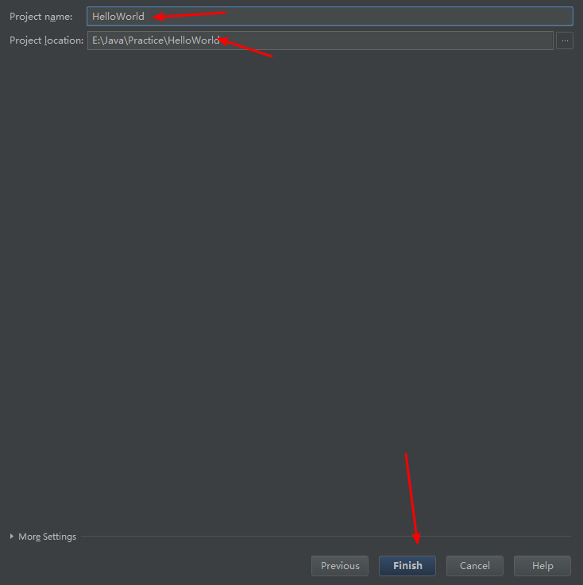
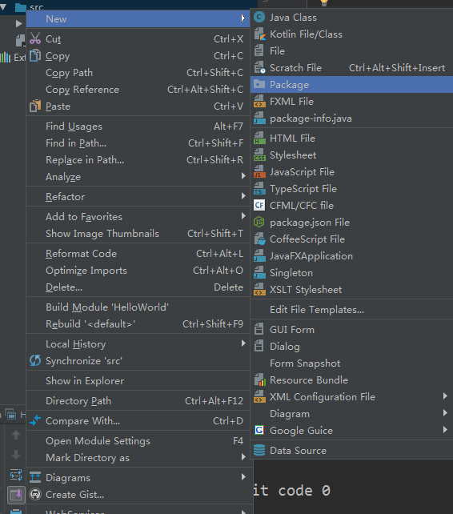
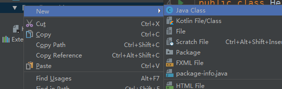
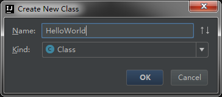
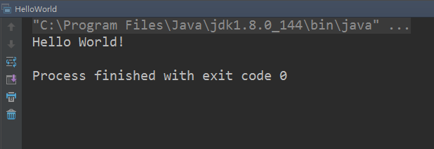

前面我们已经安装好了JDK，现在Java这个大型游戏已经安装在我们的电脑里了，接下来我们就要准备学习如何玩这个游戏了。

在入门阶段，我建议选择简单模式来进行，那么一个好的IDE是必不可少的。

## 什么是IDE

IDE（integrated development enviroment）就是集成开发环境，是用于提供程序开发环境的应用程序，一般包括代码编辑器、编译器、调试器和图形用户界面等工具。集成了代码编写功能、分析功能、编译功能、调试功能等一体化的开发软件服务套。所有具备这一特性的软件或者软件套（组）都可以叫集成开发环境。

简单来说，IDE就是将一系列工具集成到了一个应用里，让你的开发之旅变得更加容易。

## 为什么需要IDE

很多老玩家在指导刚入坑的新手时，都喜欢循循善诱，教导新手使用文本编辑器而非IDE，这样可以提高对整个编译流程的理解。讲道理，确实是这样的，但是却将开发的复杂度增加了许多，对于新手而言，每增加一个步骤，就是增加了无数种失败的姿势，很多人的学习热情就消耗在了这种无关痛痒的小问题上，觉得这个游戏怎么这么难。

所以我个人认为，开局一条狗，砍到99的打法并不适合每一个人，对于新手而言，先给一个新手套装，再来做任务会更加轻松。

## 安装IDE

接下来，我们去官网下载IDEA：http://www.jetbrains.com/idea/





根据自己的系统进行选择安装即可，这里就不分系统进行介绍了，下载的时候，可以选ultimate版，也可以选community版，建议选择ultimate版。

下载好以后安装，要激活码的时候可以看一看这个地址：http://idea.lanyus.com/ 使用前请将“0.0.0.0 account.jetbrains.com”添加到hosts文件中，然后输入激活码就能成功激活了。当然，此方法仅供学习研究使用，有经济能力的盆友还是自觉购买正版产品吧，反正我是没有经济能力的。

安装的时候，所有的都按默认选项进行安装即可。

## 新建项目

然后开始我们的第一个新手任务——HelloWorld。







创建好以后，右键src文件夹，添加package，名字叫hello，然后在package里添加HelloWorld类







然后在文件里放上代码：

```
package hello;
import java.lang.System;

public class HelloWorld {
    public static void main(String[] args){
        System.out.println("Hello World!");
    }
}
```

点击Run，运行程序，选择HelloWorld，代码就跑起来了。



至此，IDE设置完成，我们的第一个项目也完工。

如果在这个过程中遇到了任何问题，可以将关键词在百度中进行搜索，如果实在解决不了，可以加群【529253292】在群里提问，热心的群主自然会为你提供解决方案。