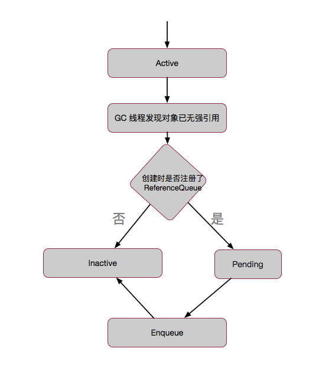

# Reference源码详解


## 定义

::: tip 
Reference是所有引用类型的父类，定义了引用的公共行为和操作。
:::

::: warning 说明
reference指代引用对象本身，referent指代reference引用的对象，下文介绍会以reference，referent形式出现。
:::

## 说明

Reference类与垃圾回收是密切配合的，所以该类不能被直接子类化。简单来讲，Reference的继承类都是经过严格设计的，甚至连成员变量的先后顺序都不能改变，所以在代码中直接继承Reference类是没有任何意义的。但是可以继承Reference类的子类。

::: tip 例如
Finalizer 继承自 FinalReference，Cleaner 继承自 PhantomReference
:::

## 构造函数

Reference类中有两个构造函数，一个需要传入引用队列，另一个则不需要。

这个队列的意义在于增加一种判断机制，可以在外部通过监控这个队列来判断对象是否被回收。如果一个对象即将被回收，那么引用这个对象的reference对象就会被放到这个队列中。通过监控这个队列，就可以取出这个reference后再进行一些善后处理。

如果没有这个队列，就只能通过不断地轮询reference对象，通过get方法是否返回null( phantomReference对象不能这样做，其get方法始终返回null，因此它只有带queue的构造函数 )来判断对象是否被回收。

这两种方法均有相应的使用场景，具体使用需要具体情况具体分析。比如在weakHashMap中，就通过查询queue的数据，来判定是否有对象将被回收。而ThreadLocalMap，则采用判断get()是否为null来进行处理。

```java
/* -- Constructors -- */
Reference(T referent) {
    this(referent, null);
}

Reference(T referent, ReferenceQueue<? super T> queue) {
    this.referent = referent;
    this.queue = (queue == null) ? ReferenceQueue.NULL : queue;
}
```

## 内部成员

Reference类内部有这么几个成员变量：

referent：保存reference指向的对象。

``` java
private T referent;
```

queue：引用对象关联的引用队列。是对象即将被回收时所要通知的队列。当对象将被回收时，reference对象( 而不是referent引用的对象 )会被放到queue里面，然后外部程序即可通过监控这个queue拿到相应的数据了。

这里的queue( 即，ReferenceQueue对象 )名义上是一个队列，实际内部是使用单链表来表示的单向队列，可以理解为queue就是一个链表，其自身仅存储当前的head节点，后面的节点由每个reference节点通过next来保持即可。

```java
volatile ReferenceQueue<? super T> queue;
```

next：指向下一个引用，Reference是一个单链表的结构。

```java
Reference next;
```
discovered：表示要处理的对象的下一个对象。

```java
/* 当处于active状态: discovered链表中下一个待处理对象
 * 当处于pending状态: pending列表中的下一个对象
 * 其它状态:   NULL
 */
transient private Reference<T> discovered;
```

lock：内部同步锁对象。用作在操作pending链表时的同步对象。注意这是一个静态对象，意味着所有Reference对象共用同一个锁。

```java
static private class Lock { }
private static Lock lock = new Lock();
```

pending：等待添加到queue中的元素链表。注意这是一个静态对象，意味着所有Reference对象共用同一个pending队列。

```java
/* 用来保存那些需要被放入队列中的reference，收集器会把引用添加到这个列表里来，
 * Reference-handler线程会从中移除它们。
 * 这个列表由上面的lock对象锁进行保护。列表使用discovered字段来链接它的元素。
 */
private static Reference<Object> pending = null;
```

::: warning 说明
queue队列使用next来查找下一个reference，pending队列使用discovered来查找下一个reference。
:::

## Reference状态

在Reference类中，有一段很长的注释，来对内部对象referent的状态进行了说明。

> Active: 
> reference如果处于此状态，会受到垃圾处理器的特殊处理。当垃圾回收器检测到referent已经更改为合适的状态后(没有任何强引用和软引用关联)，会在某个时间将实例的状态更改为Pending或者Inactive。具体取决于实例是否在创建时注册到一个引用队列中。
> 在前一种情况下（将状态更改为Pending），他还会将实例添加到pending-Reference列表中。新创建的实例处于活动状态。
>
> Pending:
> 实例如果处于此状态，表明它是pending-Reference列表中的一个元素，等待被Reference-handler线程做入队处理。未注册引用队列的实例永远不会处于该状态。
>
> Enqueued: 
> 实例如果处于此状态，表明它已经是它注册的引用队列中的一个元素，当它被从引用队列中移除时，它的状态将会变为Inactive，未注册引用队列的实例永远不会处于该状态。
>
> Inactive: 
> 实例如果处于此状态，那么它就是个废实例了(滑稽)，它的状态将永远不会再改变了。

所以实例一共有四种状态，Active（活跃状态）、Pending（半死不活状态）、Enqueued（濒死状态）、Inactive（凉凉状态）。当然，Pending和Enqueued状态是引用实例在创建时注册了引用队列才会有。

一个reference处于Active状态时，表示它是活跃正常的，垃圾回收器会监视这个引用的referent，如果扫描到它没有任何强引用关联时就会进行回收判定了。

如果判定为需要进行回收，则判断其是否注册了引用队列，如果有的话将reference的状态置为pending。当reference处于pending状态时，表明已经准备将它放入引用队列中，在这个状态下要处理的对象将逐个放入queue中。在这个时间窗口期，相应的引用对象为pending状态。

当它进入到Enqueued状态时，表明已经引用实例已经被放到queue当中了，准备由外部线程来轮询获取相应信息。此时引用指向的对即将被垃圾回收器回收掉了。

当它变成Inactive状态时，表明它已经凉透了，它的生命已经到了尽头。不管你用什么方式，也救不了它了。

JVM中并没有显示定义这样的状态，而是通过next和queue来进行判断。

```bash
Active：如果创建Reference对象时，没有传入ReferenceQueue，queue=ReferenceQueue.NULL。如果有传入，则queue指向传入的ReferenceQueue队列对象。next == null；

Pending：queue为初始化时传入ReferenceQueue对象；next == this；

Enqueue：queue == ReferenceQueue.ENQUEUED；next为queue中下一个reference对象，或者若为最后一个了next == this；

Inactive：queue == ReferenceQueue.NULL; next == this.
```

如果next==null，则reference处于Active状态；

如果next!=null，queue == ReferenceQueue.NULL，则reference处于Inactive状态；

如果next!=null，queue == ReferenceQueue.ENQUEUED，则reference处于Enqueue状态；

如果next != null，queue != ReferenceQueue.NULL && queu != ReferenceQueue.ENQUEUED ，则reference处于Pending状态。



## ReferenceHandler线程

Reference类中有一个特殊的线程叫ReferenceHandler，专门处理那些pending链表中的引用对象。ReferenceHandler类是Reference类的一个静态内部类，继承自Thread，所以这条线程就叫它ReferenceHandler线程。

```java
private static class ReferenceHandler extends Thread {
    // 确保类已经被初始化
    private static void ensureClassInitialized(Class<?> clazz) {
        try {
            Class.forName(clazz.getName(), true, clazz.getClassLoader());
        } catch (ClassNotFoundException e) {
            throw (Error) new NoClassDefFoundError(e.getMessage()).initCause(e);
        }
    }

    static {
        // 预加载并初始化 InterruptedException 和 Cleaner 类
        // 来避免出现在循环运行过程中时由于内存不足而无法加载它们		 
        ensureClassInitialized(InterruptedException.class);
        ensureClassInitialized(Cleaner.class);
    }

    ReferenceHandler(ThreadGroup g, String name) {
        super(g, name);
    }

    public void run() {
        // 死循环调用
        while (true) {
            tryHandlePending(true);
        }
    }
}
```

这个类其实也很简单，就是先预加载了两个类，然后run方法中使用了while死循环运行tryHandlerPending方法。这个方法通过名字就能大概判断，应该是来处理pending链表的，让我们看看它的内部代码：

```java
static {
    ThreadGroup tg = Thread.currentThread().getThreadGroup();
    for (ThreadGroup tgn = tg;
         tgn != null;
         tg = tgn, tgn = tg.getParent());
    // 将handler线程注册到根线程组中并设置最高优先级
    Thread handler = new ReferenceHandler(tg, "Reference Handler");
    handler.setPriority(Thread.MAX_PRIORITY);
    handler.setDaemon(true);
    handler.start();

    // 覆盖jvm的默认处理方式
    SharedSecrets.setJavaLangRefAccess(new JavaLangRefAccess() {
        @Override
        public boolean tryHandlePendingReference() {
            return tryHandlePending(false);
        }
    });
}
```

这里其实就是在静态代码段里在根线程组中启动了一条最高优先级的ReferenceHandler线程，并覆盖了JVM中对pending的默认处理方式。嗯，关键点就在 tryHandlePending(false) 这一句了。接下来再看看这里的实现：

```java
static boolean tryHandlePending(boolean waitForNotify) {
    Reference<Object> r;
    Cleaner c;
    try {
        synchronized (lock) {
            // 如果pending链表不为null，则开始进行处理
            if (pending != null) {
                r = pending;
                // 使用 'instanceof' 有时会导致OOM
                // 所以在将r从链表中摘除时先进行这个操作
                c = r instanceof Cleaner ? (Cleaner) r : null;
                // 移除头结点，将pending指向其后一个节点
                pending = r.discovered;
                // 此时r为原来pending链表的头结点，已经从链表中脱离出来
                r.discovered = null;
            } else {
                // 在锁上等待可能会造成OOM，因为它会试图分配exception对象
                if (waitForNotify) {
                    lock.wait();
                }
                // 重试
                return waitForNotify;
            }
        }
    } catch (OutOfMemoryError x) {
        Thread.yield();
        // 重试
        return true;
    } catch (InterruptedException x) {
        // 重试
        return true;
    }

    // 如果摘除的元素是Cleaner类型，则执行其clean方法
    if (c != null) {
        c.clean();
        return true;
    }

    ReferenceQueue<? super Object> q = r.queue;
    // 最后，如果其引用队列不为空，则将该元素入队
    if (q != ReferenceQueue.NULL) q.enqueue(r);
    return true;
}
```

所以，这里整个过程就是摘取pending链表的头结点，如果是Cleaner，则执行clean操作，否则进行入队处理。

## 常用方法

```java
/**
  * 返回引用指向的对象，如果referent已经被程序或者垃圾回收器清理，则返回null。
  */
public T get() {
    return this.referent;
}

/**
  * 清理referent对象，调用该方法不会使得这个对象进入Enqueued状态。
  */
public void clear() {
    this.referent = null;
}

/**
  * 判断该reference是否已经入队。
  */
public boolean isEnqueued() {
    return (this.queue == ReferenceQueue.ENQUEUED);
}

/**
  * 将该引用添加到其注册的引用队列中。
  * 如果reference成功入队则返回true，如果它已经在队列中或者创建时没有注册队列则返回false
  */
public boolean enqueue() {
    return this.queue.enqueue(this);
}
```

Reference类就是用来包装对象的，通过跟JVM的一些密切配合，使得被包裹其中的对象能够被JVM特殊处理，所以使用Reference对象可以使得我们在更细粒度上控制对象的生命周期。

## 小结

+ Reference类是所有引用类的父类

+ Reference中可以在创建时注册引用队列

+ Reference有四种状态，如果创建时没有注册引用队列，则只有两种状态

+ 可以通过get方法获取内部的对象，但如果对象已经被回收了，则会返回null 


